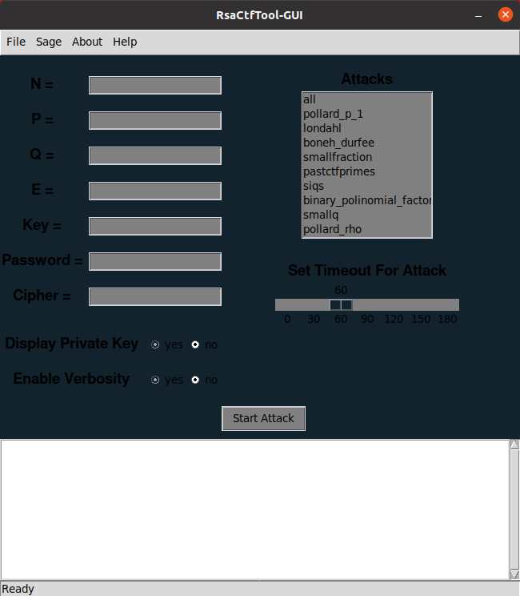

# RsaCtfTool-GUI 

**Graphical User Interface For **

**RsaCtfTool-GUI Is Not Heavily Maintained** 

# Installation

sudo git clone https://github.com/Hellsender01/RsaCtfTool-GUI.git \
cd RsaCtfTool-GUI \
sudo chmod +x setup.sh \
sudo bash setup.sh

# Test

To test the working of RsaCtfTool-GUI, Open  in RsaCtfTool(from file menu) and hit start attack. After finishing you should get the flag.

# ScreenShot

